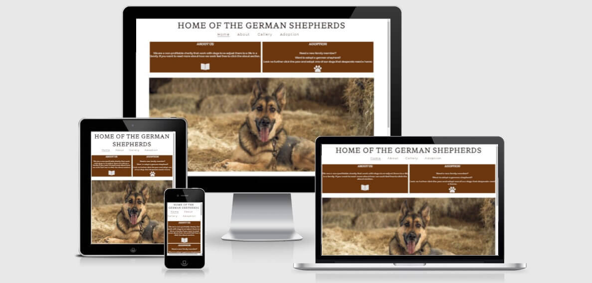

# Content

1. Introduction
2. User experience (UX)
3. Tour of the site
4. User stories
5. Testing
6. Deploying to github pages
7. Validation
8. Tech used
9. Media
10. Credits

# Introduction

I´ve created a fictional site for a milestone project at Code Institute,  Diploma in Full Stack Development.

"Home of the german shepherds" is an organisation that provides adoptions for german shepherds. My reasons for doing just this is my personal experience from these dogs and having done just what this site tries to do, recued a german shepherd from an abusive breeder. 

# User experience (UX)

I went for a simple layout where the viewer would be able to easily find the information they where looking for, this meant having short info about what we are doing and also a picture to catch the eyes off the viewer.

- ## Colors ##

My choice of colors for the page was done by picking out some colors from pictures off teh dogs. This is to include the pictures even more into the design of the page. These colors are fluent throw the entire homepage and will be used in some diffrent ways depending on how i want the part to be highlighted. 

- ## Landing page ## 

As said before i wanted a simple landing page where the information about what we are doing would be seen. This is shown by having the 2 boxes on top of the picture. one short about the orginasation and one about the main feature that being the apoption. throw the boxes you can also use the icons as links and go on to the desired page. complementing this is the Nav bar on top that we will come back to. 

Below the picture of the dog there are 2 more boxes that will show pros and cons with the breed also information that is there to catch the person that are intrested in adopting a dog.

Even further down we will find contact information and an iframe with a map showing the viewer where to find us. 

# Tour of the site

- ## Navigation ##

The Navigation of the site is located in the header centred. it shows all the diffrent pages of the site and to make it clear to the user where they are the page they currently resides on is underlined.

I choosed to make the navigation centred since this is where they will have their eyes draw upon entering the page and therefore the links will be natural to find there. 

- ## Map ##

Here is one of the exeptions i made in having a brown box with white text and looking at it side by side with the map its easy to understand why. the brown box next to a bright map would be looking missplaced, there would not be a visual link between the two.

- ## Footer ##

The looks of this is telling most of the story. Four links to four diffrent social medias. these will open up in new tabs and are also equipped with aria-labels.

- ## Gallery ##

Pictures to show the differences between how the breed of the dog can be used. People dont buy what they cant see and even if its not the real thing they see they still want a picture of what it could be. 

But most important is that the pictures show that the german shepherd isnt only a police dog, its a family member, a guard dog och just a loving companion.

- ## About ##

The page where you want to go if you want to find out more, more about the organisation, more about the dogs or you intrested in the pricing of an adoption. Colors go in the same theme as the rest of the page and the picture is there to feed the visual aswell as the brain. 

- ## Adoption ##

The main event, the reason why the site was founded. This is the end-game. This is where we want people to end up. signing up for the intrest of adopting a dog. this is easily done by providing Name and E-mail. This is all that is required. the 3 boxes are optional to tick but would provide extra information to what you wish for. but this information can be collected after and therefore i made the choice to have them optional. 

- ## Overall ##

All pictures on the site has been compressed using [tinypng.com](https://tinypng.com/) this due to the large amounts of data needed to be loaded. This reduced the data to be loaded by 45% and helpes load the page quicker.  

# User stories

## User ##

- As a user i want to get the information i need to make the choiche to adopt.

- As a user i need to feel that i can trust the owner of the website.

- As a user i want to be able to verify that the orginasation operates from somewhere and exist.

- As a user i want to be able to register my intrest for more information.

## Site Owner ##

- As a charity i want people to be able to see why we do what we do.

- As a charity i want the customers to know that we arent taking profit from this.

- As a charity i want people to know that they arent getting a toy, they are taking responibility over a life. 

- As a charity i want people to register for intrest so that i can help the dogs i rescued.

# Testing

Been running the site through both Lighthouse and [GTgetrix](https://gtmetrix.com/reports/odimac84.github.io/6QmOISNQ/) and result was a 100% performance score on GTmetrix and 98% on Lighthouse. Loading time of the site was set by GTmetrix to 5,7 seconds. 

## Further testing 

- When i first deployed it i saw some technical difficulties on mobile devices where the picture on the about page got to big and to counter that i had to set a max-height of 300 px. 
 
- What i also found was that using the grid system made the page look nice and tidy all the way up too 1440 px but after that the boxes got to big and therefore i had to set a max-width on these at 700 px.

- The adoption site had a smaller issue where the plavement of it mad the page not beeing able to be resonsive below 370px and the solution for this was to move the top box where we find the form closer to the border and make the margins smaller. and with those changes i could go as low as 320px. 

- Site had been tested on diffrent devices such as Desktop (both 1080 screen and 1440p screen), mobile (diffrent sizes) and  Laptop

- It has also been tested in diffrent browsers such as Chrome, Edge, Firefox

# Deploying to github pages

The process for deployment is documented below:

- Log into [GitHub](https://www.github.com)

- Go to the repository page for this project (https://github.com/Odimac84/Portfolio-1)

- Click on 'Settings' on the main menu over the file listing. (see first picture red marking)

- Navigate down to 'GitHub Pages' and click link. (see second picture, red marking)

- Select 'Branch: Main' from the menu. (see third picture red marking)

- This generates a live link for the website, which is now viewable publicly. (see third picture blue marking)

# Validation

Both the HTML and the CSS has been run through Validators and the errors i had been no major ones. 

- I had a error going on for a long time that i had no data in my Iframe but that was known and intensional seeing that i hadent got the map that was going in there at that point. 

- In my CSS code the only error i have found was that i had an invalid value on a text-decoration where i specified a border of 1 px where 1 px wasent a valid value, removing this solved the issue and without changing anything visual. 

- Doing validation however showed me that alot off my CSS wasent needed, and i cleaned out quite abit without it really matter for the page itself. I had seperate code for boxes that were to carry the same CSS. So even if i had no errors it showed me that a code that works isnt always the best code that you can use. 

# Tech used

# Media

# Credit

